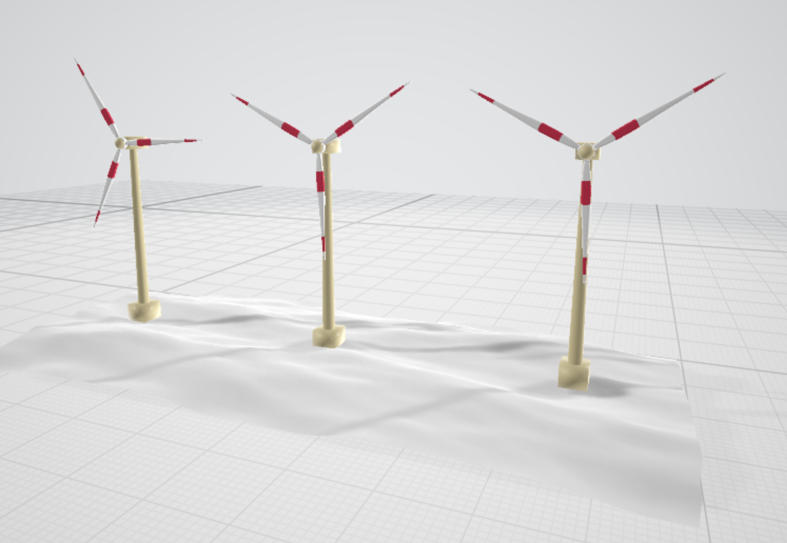
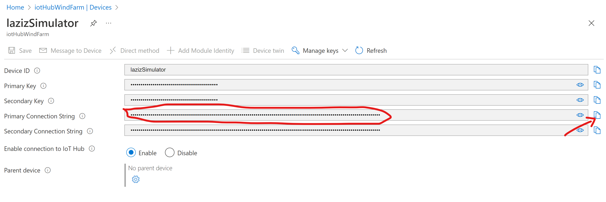
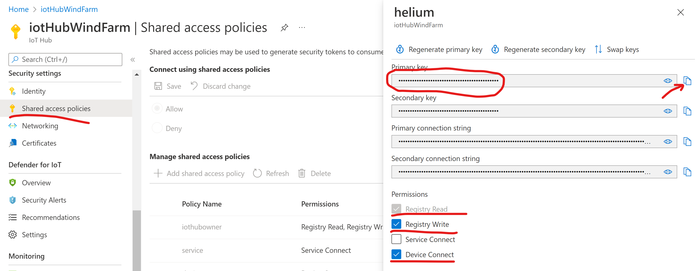
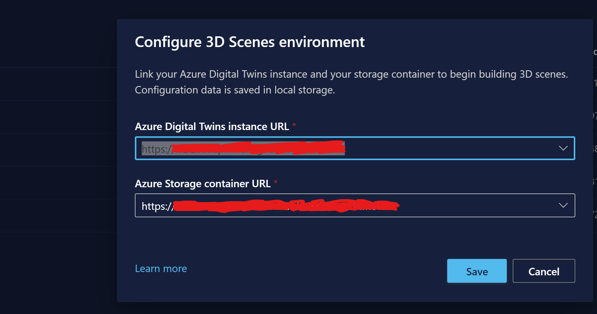
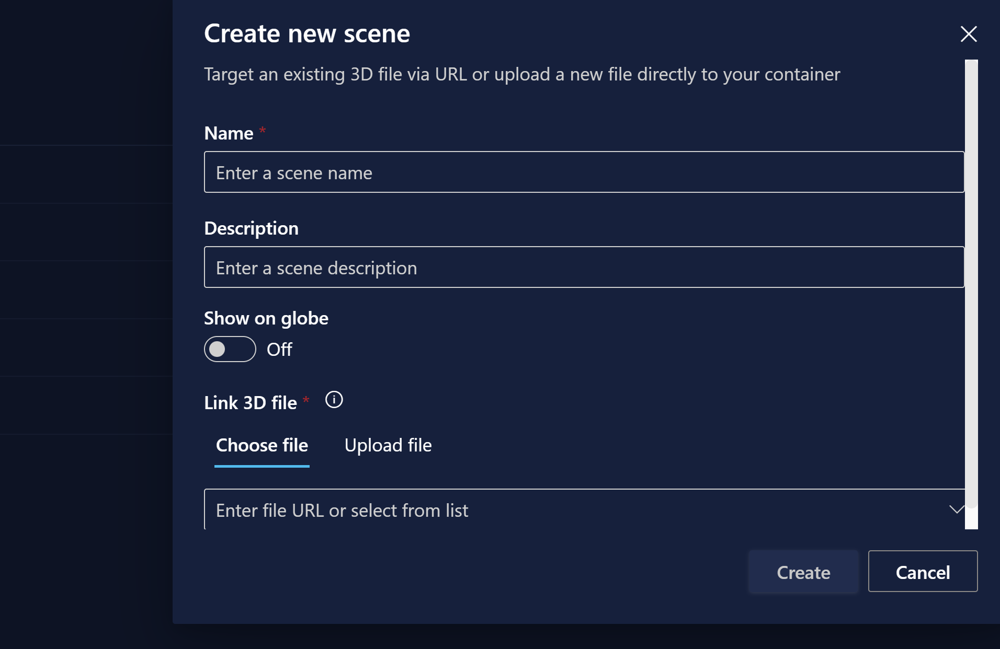
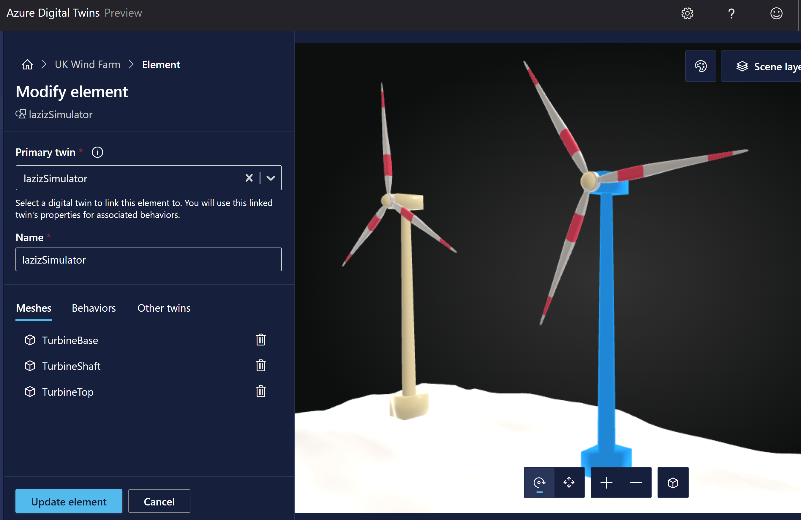
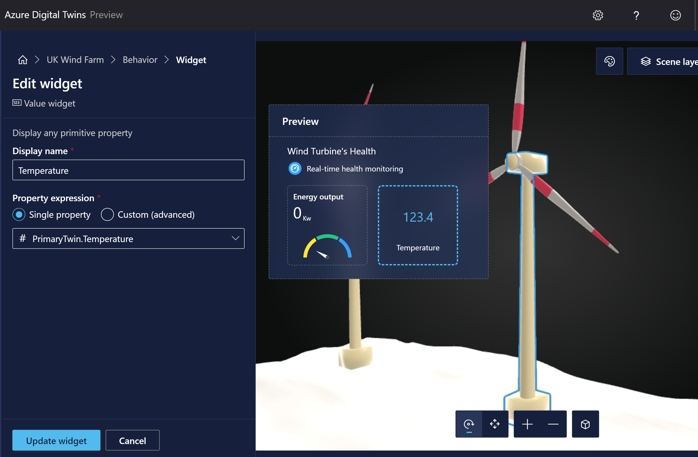
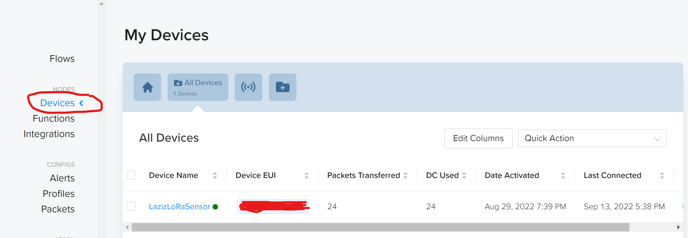
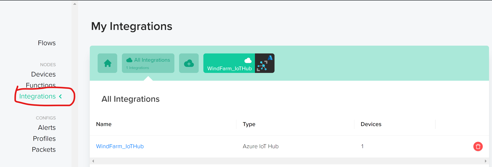
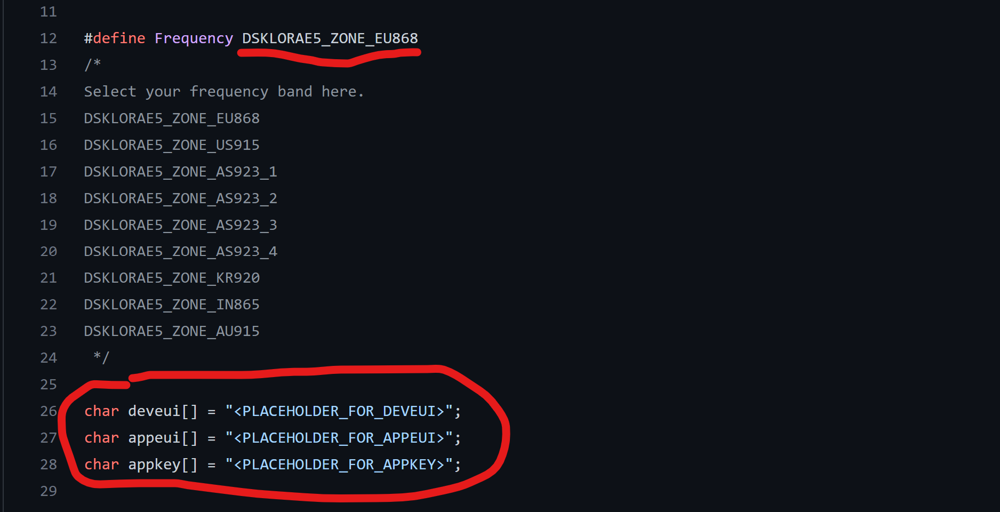

# Industry Solutions: Wind Farm's health monitoring solutions
Wind farms are great contributors to our sustainability agenda as generators of a green renewable energy. They are typically located in remote onshore / offshore locations, which makes it crucial to monitor their health and provide timely support.

In this repo, you will find a detailed step-by-step guide on how to enable ingestion of remote telemetry in Azure, update of wind farm's Azure Digital Twins (ADT) and real-time health monitoring in ADT's 3D scene.


## Table of contents:
- [Step 1 - Setup Azure Digital Twins](https://github.com/LazaUK/IndustrySolutions-WindFarm#step-1---setup-azure-digital-twins)
- [Step 2 - Setup Azure IoT Hub](https://github.com/LazaUK/IndustrySolutions-WindFarm#step-2---setup-azure-iot-hub)
- [Step 3 - Deploy Azure Function](https://github.com/LazaUK/IndustrySolutions-WindFarm#step-3---deploy-azure-function)
- [Step 4 - Configure ADT 3D scene](https://github.com/LazaUK/IndustrySolutions-WindFarm#step-4---configure-adt-3d-scene)
- [Step 5 - Generate mock telemetry with a Python simulator](https://github.com/LazaUK/IndustrySolutions-WindFarm#step-5---generate-mock-telemetry-with-a-python-simulator)
- [Step 6 - Generate real-time telemetry with a Seeed Studio's LoRaWAN Dev Kit](https://github.com/LazaUK/IndustrySolutions-WindFarm#step-6---generate-real-time-telemetry-with-a-seeed-studios-lorawan-dev-kit)
- [Appendix A: High-level system design](https://github.com/LazaUK/IndustrySolutions-WindFarm#appendix-a-high-level-system-design)
- [Appendix B: Working model - YouTube video](https://github.com/LazaUK/IndustrySolutions-WindFarm#appendix-b-working-model---youtube-video)

## Step 1 - Setup Azure Digital Twins
1. In [Azure portal](https://portal.azure.com) provision new instance of **Azure Digital Twins** (ADT);
2. Create new **Azure Storage** account and enable access to it from ADT with the following AZ command:
```
az storage cors add --services b --methods GET OPTIONS POST PUT --origins https://explorer.digitaltwins.azure.net --allowed-headers Authorization x-ms-version x-ms-blob-type --account-name <YOUR_STORAGE_ACCOUNT>
```
3. Use provided JSON models from *ADT_Models* folder to setup relevant *Organisation -> Wind Farm -> Win Turbine* hierarchy, similar to what is shown on the screenhot below.


## Step 2 - Setup Azure IoT Hub
1. In [Azure portal](https://portal.azure.com) provision new instance of **Azure IoT Hub**;
2. If you plan to use Python simulator (Step 5 below), you need to register your IoT device and copy one of its Connection String as shown below:

3. If you plan to use Seeed Studio's LoRaWAN Dev Kit (Step 6 below), you need to create a new **Shared Access Policy** with "Registry Read", "Registry Write" and "Device Connect" permissions and then copy one of its keys as shown below:

> **Note:** Once you register your Seeed device with the Helium network, Shared Access Policy's key from the Step 2.3 above will be used to auto-register your device with the Azure IoT Hub.

## Step 3 - Deploy Azure Function
1. Create a new **Azure Function** in your IDE of choice. Next sub-steps assume that you are using provided C# sample;
2. Ensure that your Azure Function is of an Azure Event Trigger type;
3. Target ADT device ID will be extracted from the message's system properties as shown in row 42 below. Adjust other variables to your sensor's telemetry values:

4. Create ADT_SERVICE_URL variable that points to your ADT instance;
5. Publish your function in Azure.
> **Note:** Use of the provided C# sample requires installation of "Azure.DigitalTwins.Core", "Azure.Identity" and "Microsoft.Azure.WebJobs.Extensions.EventGrid" packages.

## Step 4 - Configure ADT 3D scene
1. Open [3D Studio](https://explorer.digitaltwins.azure.net/3dscenes/) and configure 3D scenes environment by linking your ADT instance and Storage account from Step 1:

2. Create your first 3D scene by uploading 3D model and proving meaningful description:

3. Use meshes from your 3D model to add required elements to 3D scene:

4. Configure and assign relevant behaviour to your 3D elements from the earlier steps. Behaviour can enable *Status*, *Alerts* or *Windgets" functionality as shown below: 


## Step 5 - Generate mock telemetry with a Python simulator
1. Provided Python sample code shows how to establish connectivity with IoT Hub and submit your message. You can enhance it to the specifics of your data payload;
2. There is a dependency on Azure IoT Device SDK for Python. You can install it with pip as shown below:
```
pip install azure-iot-device
```
3. In row 7, replace placeholder with Connection String from Step 2.2.


## Step 6 - Generate real-time telemetry with a Seeed Studio's LoRaWAN Dev Kit
1. If you are using Seed Studio's LoRaWAN Dev Kit, you can follow this [Device Registration guide from the Seeed Wiki](https://wiki.seeedstudio.com/Connecting-to-Helium/#adding-grove-wio-e5-devices-to-the-helium-console) to register your kit with the Helium platform. If successful, you should get it listed under the Devices section:

> **Note:** Please, make a note of Dev EUI, App EUI and App Key as you will re-use them later in Step 6.5 below;
2. Next follow this [IoT Hub Registration guide from the Seeed Wiki](https://wiki.seeedstudio.com/Integrate-into-Azure-IoT-Hub/#integration-to-helium) to register your Azure IoT Hub. You will re-use here Shared Access Policy key from Step 2.3;

3. Telemetry received by the Helium platform needs to be decoded before its transfer to IoT Hub. Create new "custom" function as shown below. You can adapt provided Helium function (that decodes temperature and humidity readings) to the specifics of your telemetry;

4. Next, use the Flows section to link our Device, Function and IoT Hub nodes as shown below:

5. Provided Arduino sample can send temperature and humidity telemetry from the Grove SHT40 digital sensor. Don't forget to set frequency band in row 12 to the value specific for your geography. You will also re-use Dev EUI, App EUI and App Key from the earlier Step 6.1;


## Appendix A: High-level system design
## Appendix B: Working model - YouTube video
Demo of the end-to-end solution can be found here: **<PLACEHOLDER_YOUTUBE_VIDEO>**
