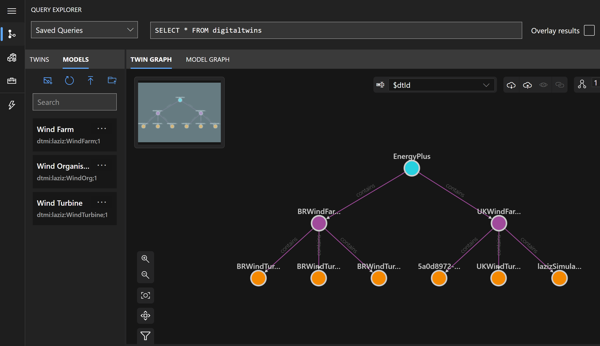

# Industry Solutions: Wind Farm's health monitoring solutions
Wind farms are great contributors to our sustainability agenda as generators of a green renewable energy. They are typically located in remote onshore / offshore locations, which makes it crucial to monitor their health and provide timely support.

In this repo, you will find a detailed step-by-step guide on how to enable ingestion of remote telemetry in Azure, update of wind farm's Azure Digital Twins (ADT) and real-time health monitoring in ADT's 3D scene.


## Table of contents:
- [Step 1 - Setup Azure Digital Twins](https://github.com/LazaUK/IndustrySolutions-WindFarm#step-1---setup-azure-digital-twins)
- [Step 2 - Setup Azure IoT Hub](https://github.com/LazaUK/IndustrySolutions-WindFarm#step-2---setup-azure-iot-hub)
- [Step 3 - Deploy Azure Function](https://github.com/LazaUK/IndustrySolutions-WindFarm#step-3---deploy-azure-function)
- [Step 4 - Configure ADT 3D scene](https://github.com/LazaUK/IndustrySolutions-WindFarm#step-4---configure-adt-3d-scene)
- [Step 5 - Generate mock telemetry with a Python simulator](https://github.com/LazaUK/IndustrySolutions-WindFarm#step-5---generate-mock-telemetry-with-a-python-simulator)
- [Step 6 - Generate real-time telemetry with a Seeed Studio's LoRaWAN Dev Kit](https://github.com/LazaUK/IndustrySolutions-WindFarm#step-6---generate-real-time-telemetry-with-a-seeed-studios-lorawan-dev-kit)
- [Appendix A: High-level system design](https://github.com/LazaUK/IndustrySolutions-WindFarm#appendix-a-high-level-system-design)
- [Appendix B: Working model - YouTube video](https://github.com/LazaUK/IndustrySolutions-WindFarm#appendix-b-working-model---youtube-video)

## Step 1 - Setup Azure Digital Twins
1. In [Azure portal](https://portal.azure.com) provision new instance of **Azure Digital Twins** (ADT);
2. Create new **Azure Storage** account and enable access to it from ADT with the following AZ command:
```
az storage cors add --services b --methods GET OPTIONS POST PUT --origins https://explorer.digitaltwins.azure.net --allowed-headers Authorization x-ms-version x-ms-blob-type --account-name <YOUR_STORAGE_ACCOUNT>
```
3. Use provided JSON models from *ADT_Models* folder to setup relevant *Organisation -> Wind Farm -> Win Turbine* hierarchy, similar to what is shown on the screenhot below.


## Step 2 - Setup Azure IoT Hub
1. In [Azure portal](https://portal.azure.com) provision new instance of **Azure IoT Hub**;
2. If you plan to use Python simulator (Step 5 below), you need to register your IoT device and copy one of its Connection String as shown below:

3. If you plan to use Seeed Studio's LoRaWAN Dev Kit (Step 6 below), you need to create a new **Shared Access Policy** with "Registry Read", "Registry Write" and "Device Connect" permissions and then copy one of its keys as shown below:

> **Note:** Once you register your Seeed device with the Helium network, Shared Access Policy's key from the Step 2.3 above will be used to auto-register your device with the Azure IoT Hub.

## Step 3 - Deploy Azure Function
1. Create a new **Azure Function** in your IDE of choice. Next sub-steps assume that you are using provided C# sample;
2. Ensure that your Azure Function is of an Azure Event Trigger type;
3. Create ADT_SERVICE_URL variable that points to your ADT instance;


## Step 4 - Configure ADT 3D scene
## Step 5 - Generate mock telemetry with a Python simulator
## Step 6 - Generate real-time telemetry with a Seeed Studio's LoRaWAN Dev Kit
## Appendix A: High-level system design
## Appendix B: Working model - YouTube video
